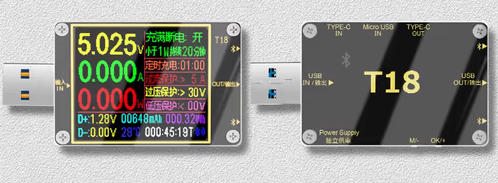

#t18ble

Read bluetooth energy meter T18 from command line



## Setup

Use your bluetooth manager to trust your bluetooth device:

```
bluetoothctl
scan on
scan off
trust <BT_MAC_ADDRESS>
```

## Usage

./t18ble <BT_MAC_ADDRESS>

## Output:

```
$ ./t18ble.py <BT_MAC_ADDRESS>
[BT_MAC_ADDRESS] Resolved services
[BT_MAC_ADDRESS]  Service [0000ffe0-0000-1000-8000-00805f9b34fb]
[BT_MAC_ADDRESS]    Characteristic [0000ffe2-0000-1000-8000-00805f9b34fb]
[BT_MAC_ADDRESS]    Characteristic [0000ffe1-0000-1000-8000-00805f9b34fb]
[BT_MAC_ADDRESS]  Service [00001801-0000-1000-8000-00805f9b34fb]
[BT_MAC_ADDRESS]    Characteristic [00002a05-0000-1000-8000-00805f9b34fb]
voltage:  5.1
current:  0.05
power:  1796.0
voltage:  5.11
current:  0.06
power:  1796.0
voltage:  5.1
current:  0.08
power:  1796.0
voltage:  5.11
current:  0.07
power:  1796.0
voltage:  5.1
current:  0.06
power:  1796.0
voltage:  5.1
current:  0.05
power:  1796.0
voltage:  5.11
current:  0.06
power:  1796.0
voltage:  5.1
...
```
